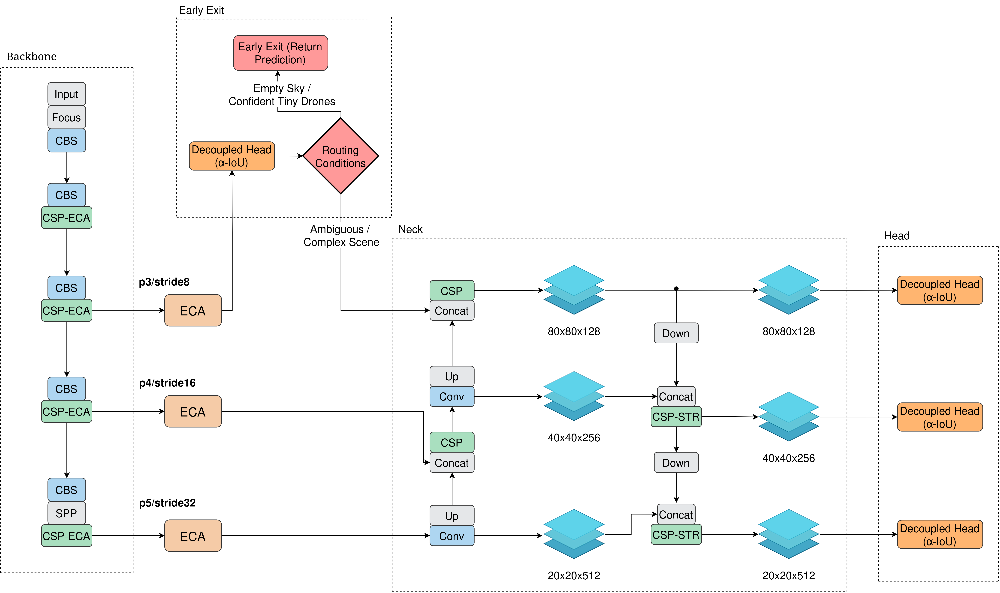

# AeroTrack

AeroTrack is a UAV multi-object tracking framework built on top of YOLOX + ByteTrack, with dynamic early-exit routing for compute-efficient inference in easy frames while keeping full-capacity processing for ambiguous scenes.

> **Paper status:** pre-publication.
> **Paper link (to be updated):** `TBD`

## Highlights

- Dynamic routing with an early-exit branch and decision gate.
- UAV-focused tracking pipeline with IoU and NWD association options.
- Built-in evaluation outputs for MOT metrics, latency, FPS, energy, and routing statistics.
- TensorRT dual-engine path for edge deployment.

## Architecture




### UAVSwarm Workstation Benchmark: Temporal Bounds, Throughput, and Energy Telemetry

| Architecture | Distance | BCET (ms) | Avg (ms) | WCET (ms) | FPS | Peak (W) | Avg (W) | Total (J) | Frame (J) |
|:---|:---|:---:|:---:|:---:|:---:|:---:|:---:|:---:|:---:|
| Baseline | IoU | 6.8 | 9.0 | 190.8 | 111.2 | -- | 32.9 | 2013.1 | 0.40 |
| Baseline | NWD | 6.6 | 8.9 | 201.7 | 111.9 | -- | 33.3 | 1997.4 | 0.40 |
| Early Exit | IoU | 3.1 | 8.2 | 220.8 | 122.8 | -- | 32.9 | 1830.6 | 0.36 |
| **AeroTrack** | **NWD** | **3.0** | **8.2** | **195.0** | **121.6** | **--** | **33.1** | **1842.2** | **0.37** |

> **Note:** Profiling executed natively on the high-performance workstation utilizing dual FP16 TensorRT engines[cite: 3, 4, 5, 6]. Algorithmic footprint: 28.24 GFLOPs (full path) vs. 13.46 GFLOPs (P3 early exit)

---

## Repository Layout

```text
/home/runner/work/AeroTrack/AeroTrack
├── aerotrack/              # Core library (models, tracker, evaluators, utils)
├── exps/                   # Experiment definitions
├── tools/                  # Train/eval/demo/data conversion scripts
├── third_party/ByteTrack/  # Upstream submodule
├── docs/
│   ├── assets/             # Figures
│   └── *.mp4               # Demo videos
├── run_evaluation.sh       # 4-config evaluation runner
├── requirements.txt
└── setup.py
```

---

## Setup

### 1) Environment

```bash
cd /home/runner/work/AeroTrack/AeroTrack
python3 -m venv .venv
source .venv/bin/activate
pip install --upgrade pip
pip install -r requirements.txt
pip install -v -e . --no-build-isolation
```

### 2) Submodules

```bash
git submodule update --init --recursive
```

---

## Dataset Format

The default experiment expects:

```text
/home/runner/work/AeroTrack/AeroTrack/dataset/UAVSwarm/
├── train/
│   └── <sequence>/img1/*.jpg
├── test/
│   └── <sequence>/img1/*.jpg
└── annotations/
    ├── train.json
    └── test.json
```

To convert MOT-style folders to COCO-like JSON used by this repo:

```bash
python tools/convert_mot_to_coco.py
```

---

## Training

```bash
python tools/train.py \
  -f exps/aerotrack_proposed.py \
  -d 1 \
  -b 16
```

To resume from checkpoint:

```bash
python tools/train.py -f exps/aerotrack_proposed.py -d 1 -b 16 --resume -c /absolute/path/to/checkpoint.pth.tar
```

---

## Evaluation (PyTorch checkpoint)

```bash
python tools/track.py \
  -f exps/aerotrack_proposed.py \
  -c /absolute/path/to/early_exit_weights.pth \
  -d 1 -b 1 \
  --fp16 --fuse \
  --distance nwd \
  --early_exit \
  --save_vis
```

### Baseline vs AeroTrack comparisons

Run all 4 combinations (IoU/NWD × baseline/early-exit):

```bash
chmod +x run_evaluation.sh
./run_evaluation.sh
```

---

## TensorRT Edge Path (Optional)

1) Export dual ONNX graphs:

```bash
python aerotrack/models/export_dual.py
```

2) Build TensorRT engines:

```bash
python tools/build_dual_trt.py
```

3) Evaluate with TensorRT:

```bash
python tools/track.py \
  -f exps/aerotrack_proposed.py \
  -d 1 -b 1 \
  --trt --fp16 --fuse \
  --distance nwd --early_exit
```

---

## Outputs

Each run writes outputs under:

```text
YOLOX_outputs/<experiment_name>_<mode>_<distance>/
```

Key files:

- `mot_evaluation_metrics.csv` (MOTA/IDF1 + latency/FPS + optional energy stats)
- `early_exit_stats.csv` (early-exit usage and routing ratios)
- `track_results/*.txt` (per-sequence tracking results)
- `track_vis/` (optional visualizations)

---

## Model Weights Policy (Recommended)

**Do not commit large trained weights directly to git history.**

For open-source usability, publish at least one reproducible inference checkpoint via **GitHub Releases** (or a stable external host) and add the download link here. This gives users immediate reproducibility without bloating the repository.

Suggested release items:

- `aerotrack_best.pth` (PyTorch checkpoint)
- Optional TensorRT engines for a specific hardware target (clearly labeled)
- SHA256 checksum + short note of the exact experiment file/commit used

---

## Citation

```bibtex
@misc{aerotrack2026,
  title={AeroTrack: Dynamic Routing for UAV Multi-Object Tracking},
  author={Ayoub Bnina},
  year={2026},
  note={Preprint forthcoming. Link will be added upon publication.}
}
```

---

## Acknowledgements

- [YOLOX](https://github.com/Megvii-BaseDetection/YOLOX)
- [ByteTrack](https://github.com/ifzhang/ByteTrack)
